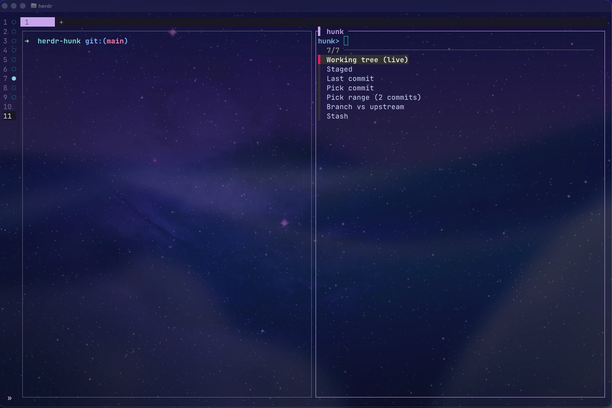
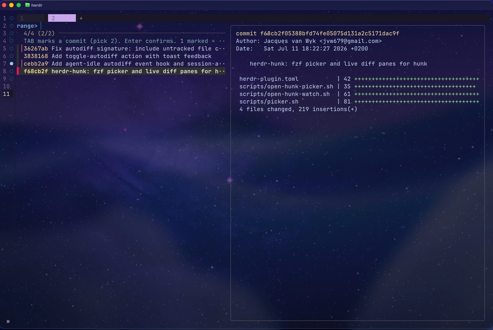
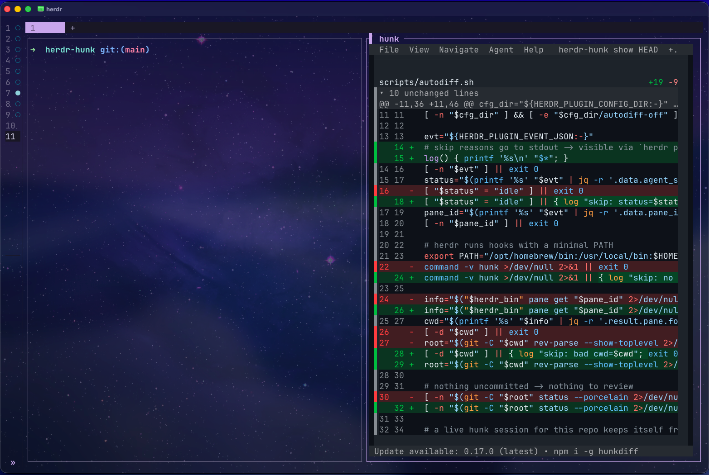
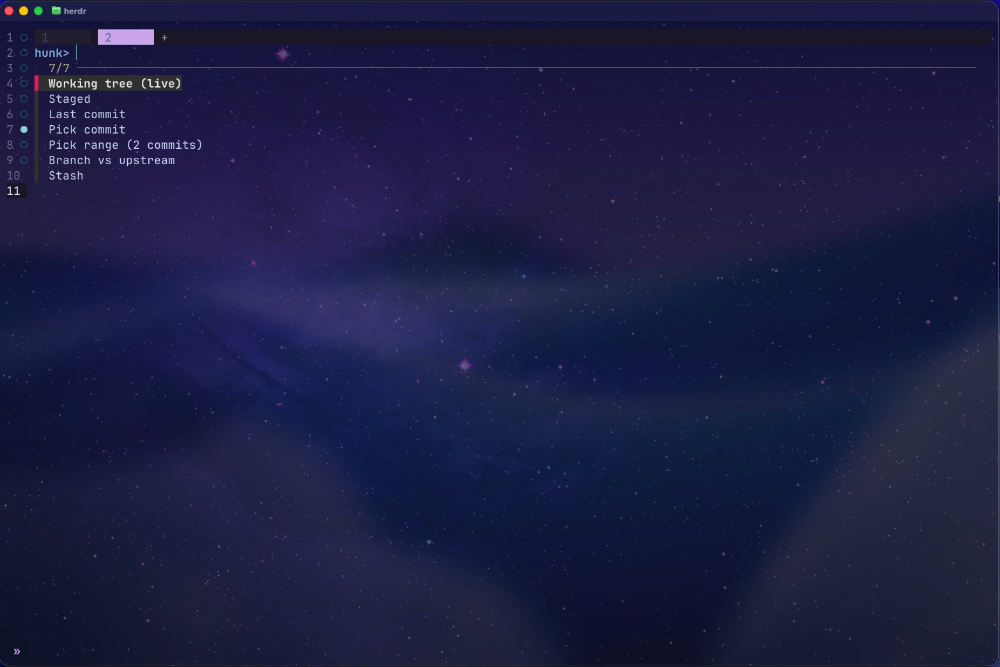
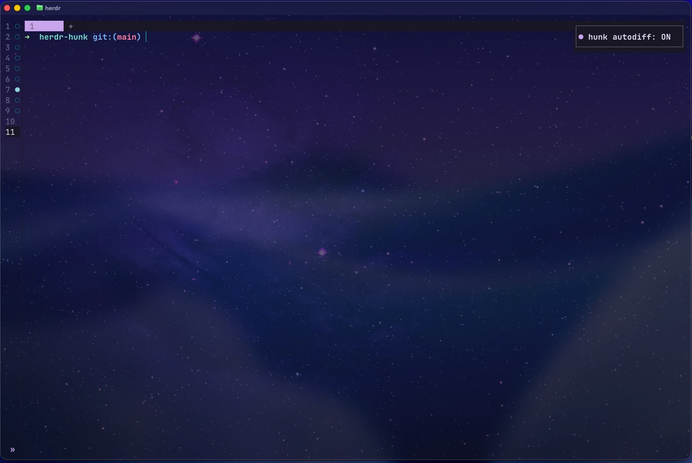

# herdr-hunk

The interactive [hunk](https://hunk.dev) plugin for [herdr](https://herdr.dev): pick any diff with fzf, review it in a pane or tab, and let it auto-open a live diff whenever a coding agent finishes with uncommitted changes.

Requires herdr ≥ 0.7.0, [hunk](https://hunk.dev) (`brew install hunk`), `fzf`, and `jq`.

## The picker

One shortcut, then choose what to review:



| Option | What it runs |
|---|---|
| Working tree (live) | `hunk diff --watch` — auto-refreshes as files change |
| Staged | `hunk diff --staged` |
| Last commit | `hunk show` |
| Pick commit | fzf over the log with stat preview → `hunk show <sha>` |
| Pick range | TAB-mark two commits → `hunk diff <older>..<newer>` (one marked = diff vs working tree) |
| Branch vs upstream | `hunk diff <upstream>..<branch>` (falls back to origin/main, origin/master, main, master) |
| Stash | fzf over `git stash list` → `hunk stash show <ref>` |

Picking a range — TAB marks, preview shows the commit stat:



The chosen diff replaces the picker in place (`q` in hunk closes the pane):



Also available full-size in its own tab:



**Session-aware:** if a hunk viewer is already open for the repo, the picker reloads it with your choice instead of stacking a second pane.

## Autodiff — auto-open when an agent finishes

When a coding agent's pane goes idle with uncommitted changes, a live hunk diff opens in a split beside it, unfocused. Works with any agent herdr tracks (claude, codex, pi, opencode, cursor, copilot, and more — `herdr integration install <agent>`).

It stays out of the way:

- skips panes that aren't in a git repo, or repos with nothing uncommitted
- skips when a hunk viewer is already open for that repo (its `--watch` keeps it fresh)
- once you close the pane, it won't reopen until the agent produces *new* changes

Toggle it with the `toggle-autodiff` action — a toast confirms the state:



## Install

```bash
herdr plugin install JacquesvanWyk/herdr-hunk
herdr plugin list   # confirm herdr-hunk is registered
```

For local development:

```bash
herdr plugin link /path/to/herdr-hunk
```

## Keybindings

Add to `~/.config/herdr/config.toml` (avoid `prefix+h`/`l` — they collide with pane navigation):

```toml
[[keys.command]]              # picker in a split
key = "prefix+d"
type = "shell"
command = "herdr plugin action invoke open-hunk-picker --plugin herdr-hunk"

[[keys.command]]              # picker in its own tab
key = "prefix+shift+d"
type = "shell"
command = "herdr plugin action invoke open-hunk-picker-tab --plugin herdr-hunk"

[[keys.command]]              # autodiff on/off
key = "prefix+a"
type = "shell"
command = "herdr plugin action invoke toggle-autodiff --plugin herdr-hunk"
```

Then reload:

```bash
herdr server reload-config
```

## Actions

| Action | Description |
|---|---|
| `open-hunk-picker` | fzf picker in a split pane |
| `open-hunk-picker-tab` | fzf picker in its own tab |
| `open-hunk-watch` | toggle a live working-tree diff split (open / focus / close) |
| `toggle-autodiff` | turn the agent-idle auto-open on or off |

Invoke any directly:

```bash
herdr plugin action invoke open-hunk-picker --plugin herdr-hunk
```

## Theme

Set `HUNK_THEME` to pass a theme to hunk (e.g. `rose-pine`, `catppuccin-mocha`, `tokyo-night`), or configure hunk itself in `~/.config/hunk/config.toml`.
